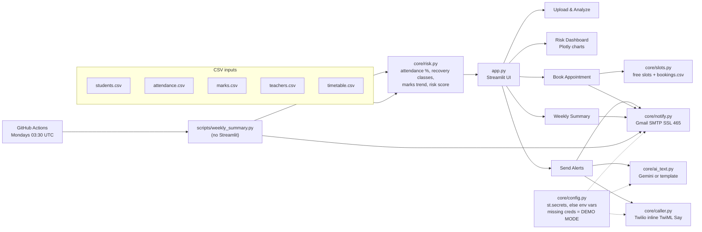

# Attendance Guardian

Early warning for attendance shortfalls and falling marks. Faculty upload an attendance sheet and recent test results; Attendance Guardian finds students near or below the required attendance, tells each one exactly how many classes in a row they must attend to recover, flags weak or falling marks, alerts students, teachers and advisers, lets students book a meeting in a teacher's free slot, and sends an automatic weekly summary.

**Live app:** `https://<your-app>.streamlit.app` *(add link after deploying)*
**Demo video:** `https://<your-video-link>` *(add link)*

---

## The problem

Colleges require a minimum attendance (often 75 to 85 percent) to sit exams. Students usually find out they are short when it is too late to recover, and teachers have no quick way to see who is slipping across subjects and departments. Falling test scores usually show up alongside poor attendance, but the two are rarely looked at together.

## Features

- **Upload and analyze.** Upload students, attendance, marks, teachers and timetable CSVs, or click *Use sample data*. Column names are matched case-insensitively, and missing columns produce a clear message that lists what was expected and what was found.
- **Adjustable threshold.** A sidebar slider sets the required attendance (default 85%). A second slider sets the warning band above it (default 3 points).
- **Recovery calculation.** For every student and subject, the app computes how many consecutive classes the student must attend to get back to the threshold.
- **Marks analysis.** Weak marks (latest test below 40) and falling marks (a drop of 15 or more points, or three strictly decreasing tests) are flagged.
- **Risk score from 0 to 100.** It combines attendance shortfall (60%) with marks weakness and trend (40%), and every table is sorted most at risk first.
- **Risk dashboard.** KPI cards, department-wise and subject-wise status charts, a subject by department attendance heatmap, and a ranked at-risk table.
- **Alerts.** Personal HTML emails to at-risk students show current %, classes needed in a row, weak subjects and a booking link. Subject teachers and faculty advisers get their own alert emails.
- **Auto-calls.** Students below the threshold get an automated Twilio voice call. The call is placed only after an explicit confirmation.
- **Appointment booking (student view).** A student enters their roll number to see their at-risk subjects and the teacher's free slots, then books one. The slot is marked booked and both sides get a confirmation email.
- **Weekly summary.** Preview it in the app and send it on demand. It is also sent automatically every Monday at 9:00 AM IST by GitHub Actions.
- **Optional AI text.** With a Gemini API key, the student email body is personalised by Gemini. Without a key, or on any API error, a specific, well-written template is used.
- **Demo mode.** With no credentials, nothing is sent. Every email and call is logged as "would send" or "would call", so the app never crashes for missing secrets.

## Architecture



`core/risk.py` is pure pandas with no Streamlit or network code, so the same logic powers the app and the scheduled job.

## How risk and recovery are computed

Let `held` and `attended` be the classes held and attended in a subject, and `r` the required attendance as a fraction (0.85 by default).

**Attendance percentage**

```
attendance_pct = attended / held * 100
```

**Recovery classes.** If the student attends the next `x` classes without a break, their attendance becomes `(attended + x) / (held + x)`. Setting this to at least `r` and solving for `x` gives:

```
x = ceil( (r * held - attended) / (1 - r) )      and x = 0 if attendance is already >= r
```

Example: 28 of 40 classes attended at r = 0.85 gives `(34 - 28) / 0.15 = 40`. After 40 more classes in a row the student has 68 of 80, which is exactly 85%.

**Status.** The thresholds follow the slider. With the defaults:

| Status | Rule | Default |
|---|---|---|
| CRITICAL | below the threshold | below 85% |
| WARNING | from the threshold up to threshold + band | 85% to 88% |
| SAFE | at or above threshold + band | 88% and above |

A student's overall status is their worst subject status.

**Marks flags**

- **Weak:** the latest test is below 40.
- **Falling:** the latest test dropped 15 or more points from the previous test, or the last three tests are strictly decreasing.

**Risk score (0 to 100), per student and subject**

```
risk_score = 100 * (0.6 * attendance_risk + 0.4 * marks_risk)
```

- `attendance_risk` is 0 at the warning cutoff and rises linearly to 0.25 at the threshold. Below the threshold it rises from 0.25 to 1.0 at 20 points under it. This means CRITICAL always outweighs WARNING.
- `marks_risk = 0.6 * level + 0.4 * trend`.
  - `level = clip((60 - latest) / 40, 0, 1)`, so a latest score of 60 or more gives 0, 40 gives 0.5, and 20 or less gives 1.
  - `trend = clip(drop / 30, 0, 1)`, raised to at least 0.5 when the last three tests are strictly decreasing.

A student's risk score is the score of their worst subject. Tables are sorted by risk score, highest first.

## Tech stack

| Layer | Tools |
|---|---|
| UI | Streamlit, Plotly |
| Logic | pandas, NumPy |
| Email | Gmail SMTP over SSL (port 465) with Python `smtplib` |
| Voice calls | Twilio Programmable Voice with inline TwiML `<Say>` (no webhook server needed) |
| AI text (optional) | Google Gemini REST API, with a template fallback |
| Scheduling | GitHub Actions cron |
| Hosting | Streamlit Community Cloud |

## Project structure

```
app.py                         Streamlit UI (5 pages)
core/
  config.py                    secrets from st.secrets or env vars; demo mode
  risk.py                      pure pandas risk logic
  notify.py                    Gmail SMTP sender and HTML email builders
  caller.py                    Twilio voice calls with inline TwiML
  slots.py                     free-slot finder and bookings CSV
  ai_text.py                   Gemini text with template fallback
scripts/
  weekly_summary.py            standalone weekly job (no Streamlit)
  generate_sample_data.py      regenerates sample_data/ (seeded)
sample_data/                   30 students, CSE and ECE, 4 subjects
.github/workflows/weekly.yml   Monday 03:30 UTC cron + manual trigger
.streamlit/config.toml         theme
.streamlit/secrets.toml.example
```

## Run locally

```bash
git clone https://github.com/ShyamSharwan007/attendance-guardian.git
cd attendance-guardian
python -m venv .venv
# Windows: .venv\Scripts\activate    macOS/Linux: source .venv/bin/activate
pip install -r requirements.txt
streamlit run app.py
```

The app opens with the sample data loaded and runs in demo mode until you add secrets.

## Secrets

Copy `.streamlit/secrets.toml.example` to `.streamlit/secrets.toml` and fill in what you need. This file is in `.gitignore`. Every key is optional, and each channel without credentials stays in demo mode.

| Key | Purpose |
|---|---|
| `GMAIL_USER` | Gmail address that sends the emails |
| `GMAIL_APP_PASSWORD` | 16-character Gmail App Password (needs 2-Step Verification) |
| `SENDER_NAME` | Display name on outgoing email |
| `TWILIO_ACCOUNT_SID`, `TWILIO_AUTH_TOKEN` | Twilio credentials (`TWILIO_SID`, `TWILIO_TOKEN` also accepted) |
| `TWILIO_FROM_NUMBER` | Your Twilio phone number in E.164 format (`TWILIO_FROM`, `TWILIO_PHONE_NUMBER` also accepted) |
| `DEFAULT_COUNTRY_CODE` | Optional, default `+91`, used for 10-digit numbers |
| `GEMINI_API_KEY` | Optional, turns on AI-personalised email text |
| `GEMINI_MODEL` | Optional, default `gemini-2.5-flash` |
| `APP_URL` | Public app URL, used for the booking link in emails |
| `TEST_EMAIL` | Optional. When set, every email goes here instead of the real recipient |
| `TEST_PHONE` | Optional. When set, every call goes here (use your verified Twilio number) |
| `DEMO_MODE` | Optional. Set to `"true"` to simulate everything even with credentials |

**For demos, set `TEST_EMAIL` and `TEST_PHONE` to your own email and phone.** You then receive every real email and call yourself. The sample data uses reserved `example.edu` addresses and deliberately invalid `+910000…` phone numbers, so no real person can be contacted by accident. A sidebar toggle can also force demo mode at any time.

## Deploy on Streamlit Community Cloud

1. Push this repository to GitHub.
2. Go to [share.streamlit.io](https://share.streamlit.io), click **Create app**, and pick this repo, branch `main`, and main file `app.py`.
3. Under **Advanced settings > Secrets**, paste the contents of your `secrets.toml`. Set `APP_URL` to the app's public URL.
4. Deploy, then put the link at the top of this README.

Bookings are written to `data/bookings.csv` and mirrored in the session. Community Cloud storage is temporary, so bookings reset when the app restarts.

## Weekly summary automation

`.github/workflows/weekly.yml` runs `scripts/weekly_summary.py` every Monday at 03:30 UTC (9:00 AM IST). You can also start it from the **Actions** tab with **Run workflow**. The job emails each faculty adviser a summary of their own advisees and uploads HTML copies as a build artifact.

Add these under **Settings > Secrets and variables > Actions**:

- **Secrets:** `GMAIL_USER`, `GMAIL_APP_PASSWORD`, `APP_URL`, plus optional `SENDER_NAME`, `TEST_EMAIL`, `TEST_PHONE`, `TWILIO_ACCOUNT_SID`, `TWILIO_AUTH_TOKEN`, `TWILIO_FROM_NUMBER`.
- **Variables (optional):** `ATTENDANCE_THRESHOLD` (default 85), `WARNING_MARGIN` (default 3), `SUMMARY_TO` (send one full summary to a single address), `AUTO_CALL` (`true` to also auto-call students below the threshold).

Without secrets the job runs in demo mode and prints what it would send. Run it locally with:

```bash
python scripts/weekly_summary.py            # one summary per adviser
python scripts/weekly_summary.py --to hod@college.edu
python scripts/weekly_summary.py --call     # also auto-call students below threshold
```

## Input format

| File | Required columns |
|---|---|
| `students.csv` | `roll_no, name, department, email, phone, adviser_name, adviser_email` |
| `attendance.csv` | `roll_no, subject, classes_held, classes_attended` |
| `marks.csv` | `roll_no, subject, test1, test2, test3` (out of 100; any number of `testN` columns works) |
| `teachers.csv` | `teacher_name, email, subject` |
| `timetable.csv` | `teacher_name, day, slot, status` with slot like `09:00-10:00` and status `busy` or `free` |

Students, attendance and marks are required. If teachers or timetable are not uploaded, the sample versions are used. The *Download CSV templates* section on the upload page gives you the sample files to start from.

## Sample data

`sample_data/` holds 30 students across CSE and ECE and 4 subjects. With the default settings it produces this mix:

| Group | Students |
|---|---|
| Critical (below 85% in at least one subject) | 9 |
| Warning (85% to 88%) | 6 |
| Safe attendance but weak or falling marks | 3 |
| Safe | 12 |

Regenerate it with `python scripts/generate_sample_data.py`.
